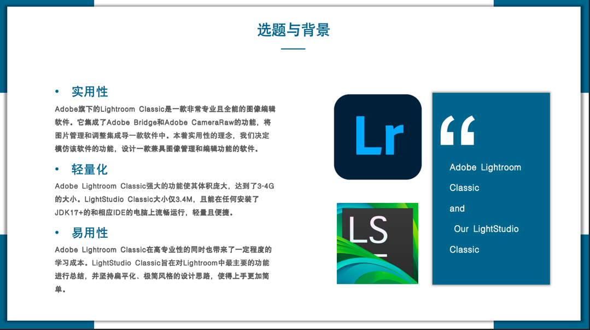
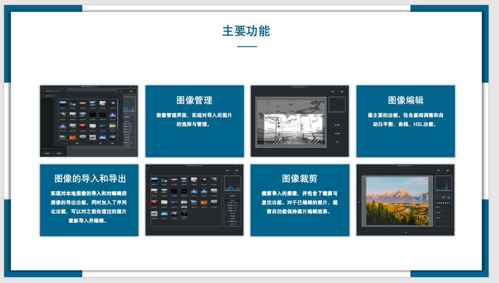
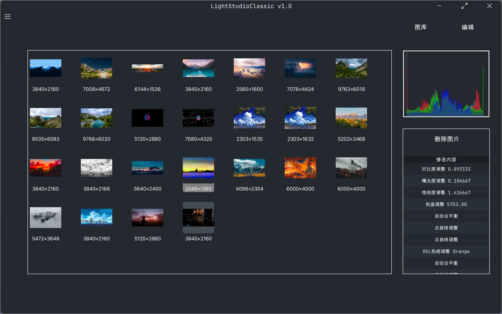
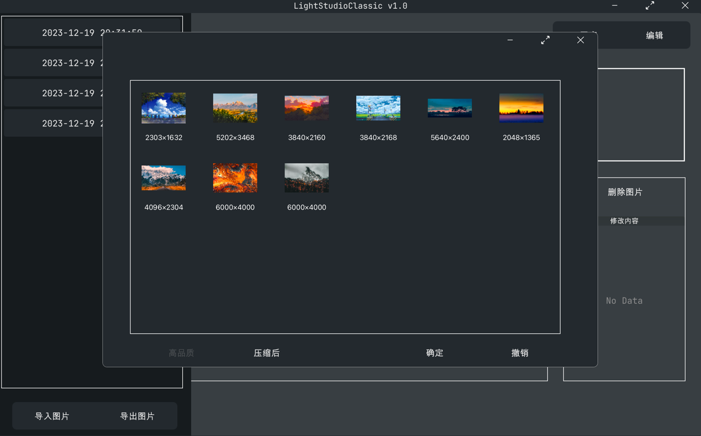
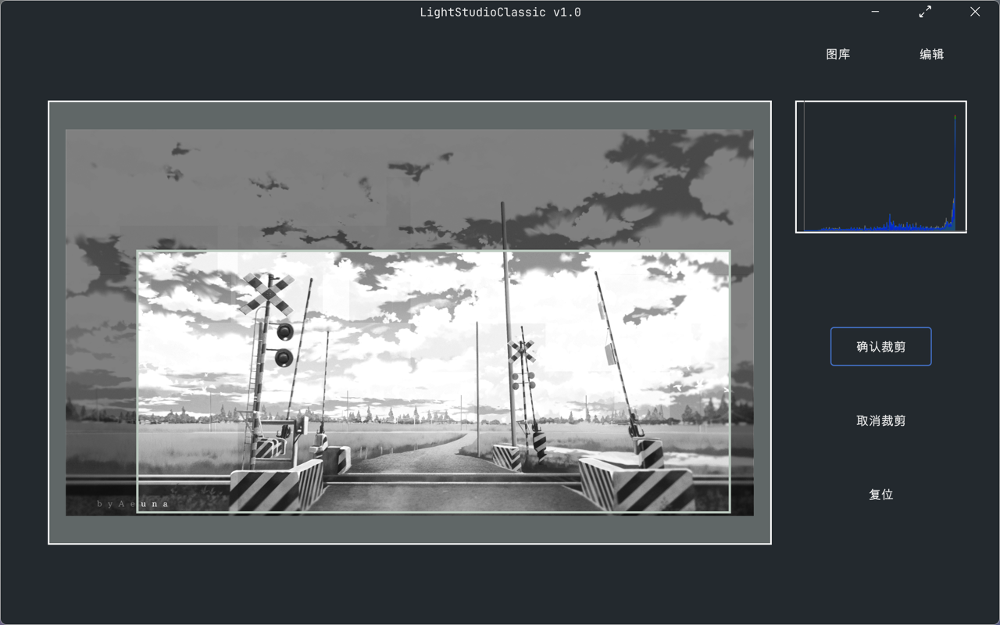
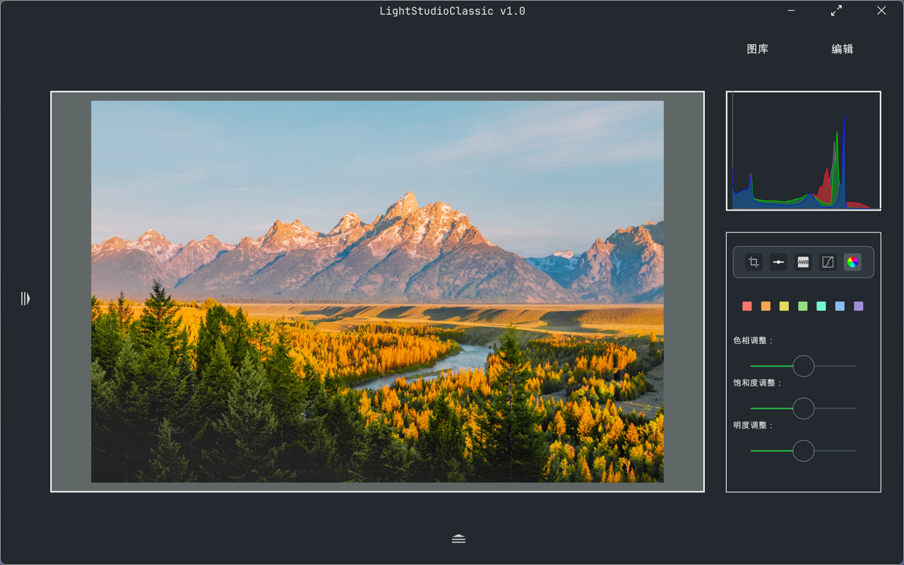

# LightStudioClassic

    北京航空航天大学软件学院2022级面向对象程序设计大作业
    

这是一个基于JavaFX框架开发的类似Adobe Lightroom Classic的照片管理、编辑软件

- 受限于时间和能力，最后仅实现了草图中的部分功能😇

### 整体功能：

### 图像管理页面：

### 图像导入导出页面：

### 图像裁剪界面：

### 图像编辑界面：

### 程序设计草图（初稿）：

